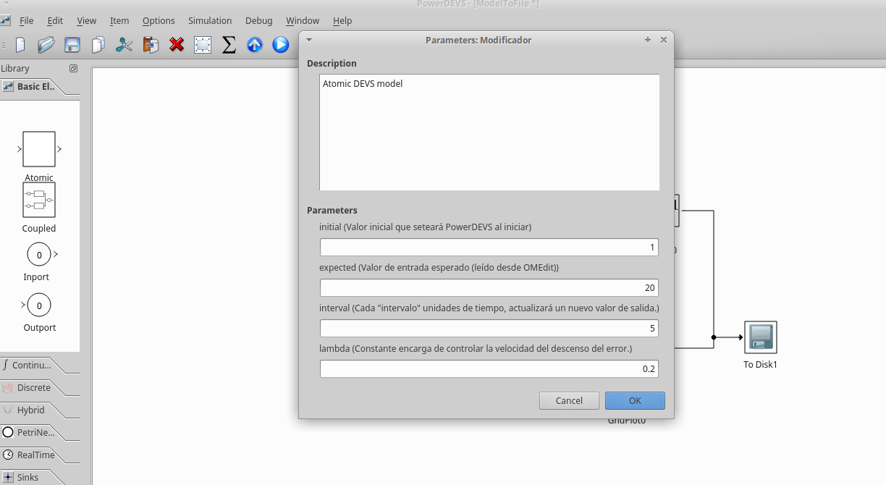
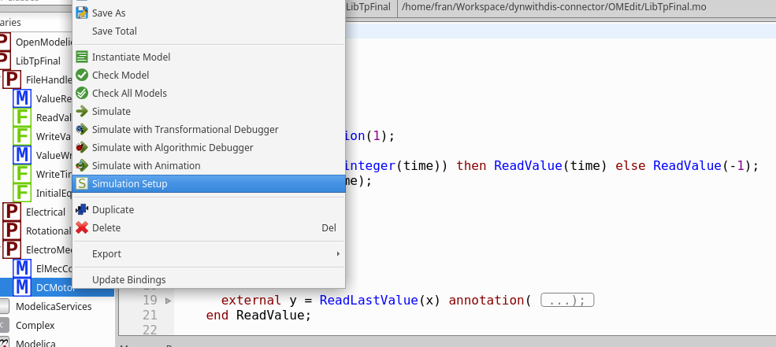
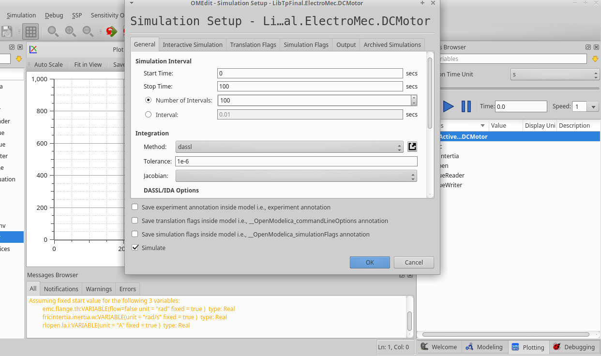
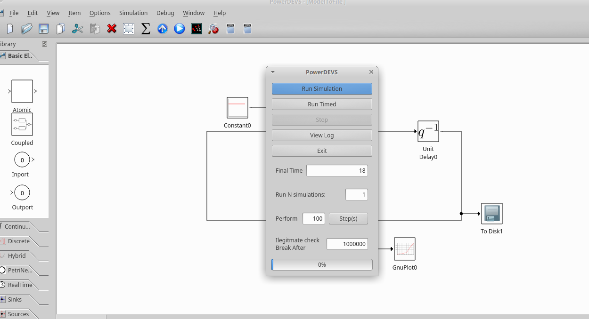
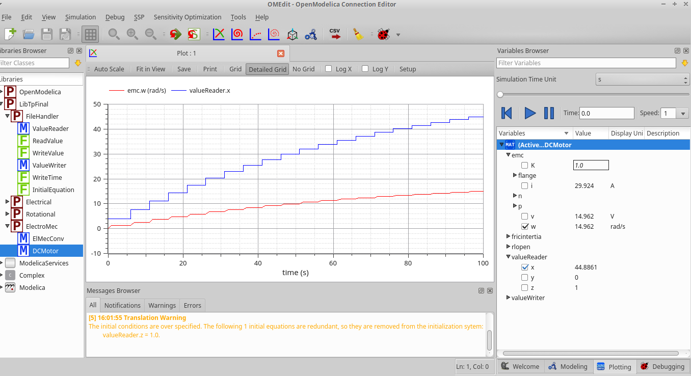

# Conexión entre modelos de simulación discretos y dinámicos

## Trabajo práctico final para la materia Modelado y simulación de sistemas continuos

> Realizado por Franco Sansone y Ciro Barbagelata.

---

## Motivación

Existen programas especializados en modelar y simular sistemas dinámicos y otros especializados en sistemas discretos. Se visualiza una oportunidad al combinar y aprovechar lo mejor de ambos.

## Idea

La idea de este trabajo es aprovechar ambos creando una comunicación entre los mismos para que puedan funcionar y modificarse a la vez.

El modelo implementado en _modelica_ escribirá su salida en un archivo y cada N unidades de tiempo, esperará una nueva entrada, esta entrada será brindada por el modelo implementado en POWERDevs.

El modelo implementado en POWERDevs leerá la salida del sistema dinámico y escribirá una nueva entrada disminuyendo el error, para alcanzar el valor esperado.

La salida del sistema dinámico es la entrada del sistema discreto, y visceversa.

Para este trabajo se utilizó el sistema electromecánico definido en el último trabajo práctico de la materia. Se modificó el voltaje (el cual era constante en 12), se lo convirtió en una variable, la cual es modificada por el modelo implementado en PowerDEVS. Este sistema no  tiene utilidad práctica, sino que fue un medio para probar la conexión entre ambos programas.

## Instalación

Para instalar las dependencias necesarias solo debe correrse el script _compile.sh_ (sin permisos de administrador ni nada por el estilo). Este creará dos directorios, uno para el código de modelica (/opt/modelica/), otro para el de POWERDevs ($HOME/powerdevs/atomics/tpfinal/). Revisar que estos directorios no existan previamente, principalmente el de modelica.

## Ejecución

Para la comunicación, ambos sistemas escribirán archivos y se esperarán mutuamente. Para mayor claridad explicaré con un ejemplo.

Abrimos los archivos _OMEdit/LibTpFinal.mo_ en OMEdit y _PowerDEVS/ModelToFile.pdm_ en PowerDEVS.

Si hacemos doble click en el bloque **Modificador** de nuestro modelo en PowerDEVS veremos lo siguiente:

Los parámetros podemos ajustarlos según querramos.

* El valor _initial_ será la primera entrada del sistema dinámico.
* El valor _expected_ es la salida esperada de nuestro sistema dinámico.
* El valor _interval_ son las unidades de tiempo que esperará el sistema discreto en actualizar su salida.
* El valor _lambda_ es un multiplicador que controla la velocidad del descenso del error.

Luego configuramos la simulación en OMEdit dando click derecho en DCMotor.

En este ejemplo correremos la simulación de 0 a 100 unidades de tiempo.

Luego ejecutamos la simulación en PowerDEVS. Para saber cual debe ser el tiempo final, debemos hacer la siguiente cuenta.
Si n es el tiempo final de la simulación en modélica, el tiempo final de PowerDEVS debe ser n/_interval_ - 2 (se resta 2 porque no se cuentan los primeros y los últimos intervalos).

En nuestro caso sería 100 / 5 - 2 = 18

Los sistemas se esperan mutuamente 10 segundos antes de iniciar.

En esta prueba obtenemos los siguientes resultados:

La línea azul corresponde a la entrada del sistema, voltaje del RLOpen, la roja a la velocidad angular de nuestro modelo de motor electromecánico, valor que intentamos modificar.

---

En cuanto a la implementación de los modelos del paquete FileHandler, en general las variables son _artificiosas_ dado que las funciones externas generan efectos laterales y estas variables no representan ningún valor existente.

Para extender este trabajo sería interesante, del lado de PowerDEVS, convertir el bloque _Modificador_ en dos bloques, uno enncargado de esperar la evolución del sistema dinámico, otro encargado de controlar el error, y así facilitar la implementación de diferentes métodos del descenso del error.

También resulta interesante automatizar la incialización de los sistemas, cuya configuración e inicialización ahora es manual.
